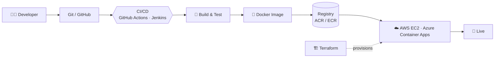

<!-- ========================================================= -->
<!--  PROFILE README — Sohail Shah Quadri                      -->
<!--  Repo must be named: sohailsq/sohailsq (profile repo)     -->
<!-- ========================================================= -->

<p align="center">
  
</p>

<p align="center">
  <a href="https://github.com/sohailsq?tab=followers"></a>
  
</p>

<p align="center">
  <a href="https://sohail-shah-portfolio.vercel.app/"></a>
  <a href="https://www.linkedin.com/in/mssq14/"></a>
  <a href="mailto:mohammadsohailshahquadri14@gmail.com"></a>
</p>

<p align="center">
  
</p>

---

## 👨‍💻 About Me

I'm a **Software Engineer** from Hyderabad, India, who enjoys turning ideas into production-ready products — from React Native trading apps to MERN platforms with AI/ML under the hood. I care about clean APIs, reliable deployments and shipping things people actually use.

- 🔭 Currently deepening **DevOps, Cloud Architecture, Kubernetes & Infrastructure as Code**
- 🌱 Learning **System Design** and **scalable backend architecture**
- 🇩🇪 Open to roles in **India, Germany & Europe**
- ⚡ Fast learner — I pick up new stacks quickly and ship early

```ts
const sohail = {
  name: "Sohail Shah Quadri",
  role: "Software Engineer",
  location: "Hyderabad, India",
  stack: {
    frontend: ["React", "React Native", "Redux Toolkit", "Vite", "Tailwind CSS"],
    backend:  ["Node.js", "Express", "FastAPI", "REST", "JWT", "WebSockets"],
    data:     ["MongoDB", "MySQL"],
    devops:   ["Docker", "GitHub Actions", "Jenkins", "Terraform", "Linux"],
    cloud:    ["AWS (EC2)", "Azure (Container Apps, ACR)", "Vercel", "Render"],
  },
  learning: ["Kubernetes", "IaC", "System Design", "Cloud Architecture"],
  motto: "Build. Automate. Deploy. Learn. Repeat.",
} as const;
```

---

## 🛠️ Tech Stack

<p align="center">
  
</p>
<p align="center">
  
</p>

> `Expo` · `WebSockets` · `JWT` · `scikit-learn (Random Forest)` · `Vercel` · `Render`

---

## 🚀 Featured Projects

| Project | What it is | Stack |
|---|---|---|
| 🇩🇪 **[NexaDeutsch](https://nexa-deutsch.vercel.app/)** | German A1 (CEFR) exam-prep learning platform | React · Node · Express · MongoDB · Redux Toolkit |
| 📈 **JetFyx** | Real-time forex trading mobile app | React Native · WebSockets · Node · AWS |
| 🏥 **SmartSync** | Medical tracking app with AI/LLM integration | React · Node · Express · MongoDB · LLM |
| 📊 **Prodify** | Productivity platform with ML-driven insights | React · Node · MongoDB · FastAPI · Random Forest |

<!--
  Optional: show live pinned repo cards. Replace REPO_NAME with your real repo names, then uncomment.

<p align="center">
  <a href="https://github.com/sohailsq/REPO_NAME"></a>
  <a href="https://github.com/sohailsq/REPO_NAME"></a>
</p>
-->

---

## ☁️ My Delivery Pipeline



**CI/CD** — GitHub Actions · Jenkins · automated builds · deployment pipelines
**Cloud** — AWS EC2 · Azure Container Apps · Azure Container Registry · Vercel · Render
**Infra & Automation** — Docker · Terraform (IaC) · Linux · containerization

---

## 📊 GitHub Stats

<p align="center">
  <picture>
    <source media="(prefers-color-scheme: dark)" srcset="https://github-readme-stats.vercel.app/api?username=sohailsq&show_icons=true&theme=tokyonight&hide_border=true&count_private=true&include_all_commits=true&rank_icon=github">
    
  </picture>
  <picture>
    <source media="(prefers-color-scheme: dark)" srcset="https://github-readme-stats.vercel.app/api/top-langs/?username=sohailsq&layout=compact&theme=tokyonight&hide_border=true&langs_count=8">
    
  </picture>
</p>

<p align="center">
  <picture>
    <source media="(prefers-color-scheme: dark)" srcset="https://streak-stats.demolab.com?user=sohailsq&theme=tokyonight&hide_border=true">
    
  </picture>
</p>

<p align="center">
  <picture>
    <source media="(prefers-color-scheme: dark)" srcset="https://github-readme-activity-graph.vercel.app/graph?username=sohailsq&theme=tokyo-night&hide_border=true&area=true">
    
  </picture>
</p>

<p align="center">
  
</p>

### 🐍 Contribution Snake

<p align="center">
  <picture>
    <source media="(prefers-color-scheme: dark)" srcset="https://raw.githubusercontent.com/sohailsq/sohailsq/output/github-snake-dark.svg">
    
  </picture>
</p>

---

## 🎯 2026 Goals

- [ ] Ship production-ready apps with full CI/CD
- [ ] Get hands-on with **Kubernetes** (deploy a real workload)
- [ ] Provision cloud infra end-to-end with **Terraform**
- [ ] Strengthen **AWS & Azure** skills (certifications as a stretch goal)
- [ ] Improve **System Design** & scalable backend architecture
- [ ] Contribute to **open source**

---

## 📫 Let's Connect

<p align="center">
  <a href="https://www.linkedin.com/in/mssq14/"></a>
  <a href="https://github.com/sohailsq"></a>
  <a href="https://sohail-shah-portfolio.vercel.app/"></a>
  <a href="mailto:mohammadsohailshahquadri14@gmail.com"></a>
</p>

<p align="center">

### 💡 "Build. Automate. Deploy. Learn. Repeat."

⭐ If you like my projects, drop a star!

</p>

<p align="center">
  
</p>
